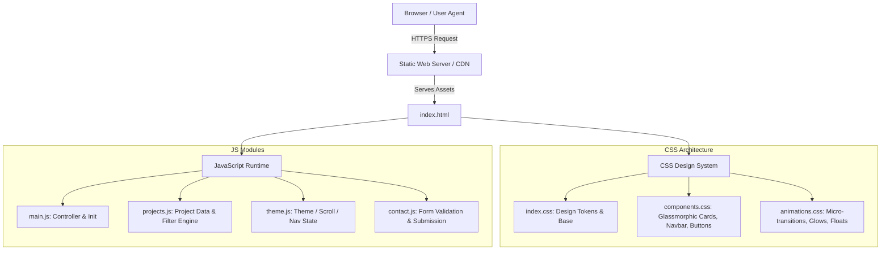

# Portfolio Website Architecture Document

## 1. Executive Summary & Philosophy

This document outlines the architectural blueprint, design principles, and technical stack for Sudeep Kumar Surya's personal portfolio website.

The goal is to deliver an **exceptional, ultra-modern, high-performance portfolio** that delivers an instant "wow" factor through clean design, fluid micro-interactions, dark glassmorphism aesthetic, and zero unnecessary framework bloat.

---

## 2. Technical Stack & Rationale

| Layer | Technology | Rationale |
| :--- | :--- | :--- |
| **Markup** | HTML5 (Semantic) | Accessible, SEO-friendly, zero-overhead baseline. |
| **Styling** | Vanilla CSS3 (Custom Design System) | Full control over design tokens, CSS variables, glassmorphism, responsive breakpoints, avoiding bloated CSS libraries. |
| **Logic & Interactivity** | Modern JavaScript (ES6+ Modules) | Modular, fast, native browser compatibility, lightweight state handling (filtering, animations, theme toggling). |
| **Typography** | Google Fonts (`Inter` / `Outfit`) | Clean geometric sans-serif delivering a sleek modern tech look. |
| **Iconography** | SVG / Lucide Icons | Scalable, crisp on high-DPI displays, and customizable via CSS fill/stroke. |
| **Hosting & CI/CD** | GitHub Pages / Vercel | Seamless continuous deployment from git commits. |

---

## 3. System Architecture Diagram

---

## 4. UI/UX & Design System Specifications

### 4.1 Color Palette (Dark Mode First)
- **Background Primary**: `#0A0D14` (Deep space obsidian)
- **Background Secondary**: `#121826` (Subtle elevated charcoal)
- **Surface / Card (Glassmorphism)**: `rgba(255, 255, 255, 0.04)` with `backdrop-filter: blur(16px)` and `1px solid rgba(255, 255, 255, 0.08)` border
- **Accent Primary**: `#6366F1` (Electric Indigo)
- **Accent Glow**: `#A855F7` / `#38BDF8` (Cyan & Violet gradient accents)
- **Text Primary**: `#F8FAFC` (High-contrast slate)
- **Text Secondary**: `#94A3B8` (Muted readable slate)

### 4.2 Typography Hierarchy
- **Display Heading (`H1`)**: 3.5rem - 4.5rem, weight 800, gradient masked text.
- **Section Heading (`H2`)**: 2rem - 2.5rem, weight 700 with badge accent.
- **Card Heading (`H3`)**: 1.25rem - 1.5rem, weight 600.
- **Body Text**: 1rem (16px), line-height 1.6, weight 400.

### 4.3 Key Components
1. **Glassmorphic Navigation Bar**: Sticky header with blur, logo, section links, and resume CTA.
2. **Hero Section**: Magnetic hook, developer title, bio snippet, quick CTAs, and interactive ambient glow.
3. **About & Skills Matrix**: Tabbed/categorized skill chips (Frontend, Backend, DevOps, Tools).
4. **Interactive Projects Gallery**: Filterable grid (All, Full Stack, Frontend, Systems) with tags, repo links, and live demo buttons.
5. **Experience & Milestones**: Timeline view of education, certifications, or career milestones.
6. **Contact Section**: Functional form interface with input validation, social links, and email link.
7. **Footer**: Quick navigation, copyright, and back-to-top button.

---

## 5. Performance, Accessibility & SEO Architecture

- **Lighthouse Targets**: 95+ in Performance, Accessibility, Best Practices, and SEO.
- **Responsive Breakpoints**:
  - Mobile: `< 640px`
  - Tablet: `640px - 1024px`
  - Desktop: `> 1024px`
- **SEO & Meta**: Complete OpenGraph, Twitter card tags, favicon package, structured JSON-LD schema for Person.
- **Asset Optimization**: High-compression WebP images, vector SVGs for icons, defer-loaded scripts.
