# Portfolio Implementation Phases & Roadmap

This document outlines the step-by-step phases to build and deliver the personal portfolio website for **Sudeep Kumar Surya**.

---

## 🗺️ Roadmap Overview

```mermaid
gantt
    title Portfolio Implementation Roadmap
    dateFormat  X
    axisFormat Phase %s
    section Phase 1: Foundation
    Tokens, Reset & Base Architecture :active, 0, 1
    section Phase 2: Core Components
    Navbar, Hero & Footer : 1, 2
    section Phase 3: Content Sections
    About, Skills Matrix & Timeline : 2, 3
    section Phase 4: Dynamic Projects
    Project Cards, Filters & Modal : 3, 4
    section Phase 5: Contact & Interactions
    Form, Micro-animations & Glows : 4, 5
    section Phase 6: Polish & Deployment
    SEO, Performance Audit & Deploy : 5, 6
```

---

## 📋 Detailed Phase Breakdown

### Phase 1: Project Setup & Design System Foundation
- [ ] Initialize clean directory structure (`assets/css/`, `assets/js/`, `assets/images/`).
- [ ] Create `index.css` defining:
  - CSS Custom Properties (Colors, Gradients, Shadows, Transitions, Radius, Typography).
  - CSS Reset & standard box-sizing.
  - Base utility classes (`.container`, `.gradient-text`, `.glass-card`, `.badge`).
- [ ] Establish base HTML skeleton in `index.html` with modern meta tags and font imports.

### Phase 2: Shell & Hero Section
- [ ] Build **Glassmorphic Navigation Bar**:
  - Brand identity/logo.
  - Smooth anchor links (`#about`, `#skills`, `#projects`, `#contact`).
  - Mobile hamburger toggle menu with animated drawer.
- [ ] Implement **Hero Section**:
  - Impactful headline with gradient text mask.
  - Tagline & status pill (e.g., "Available for opportunities").
  - Primary CTA buttons ("View Work", "Contact Me").
  - Ambient radial background glow animations.

### Phase 3: About & Skills Matrix
- [ ] Build **About Section**:
  - Professional bio, core principles, and quick statistics counters (e.g., projects built, tech mastered).
- [ ] Build **Skills Matrix**:
  - Categorized grid (Frontend, Backend, Databases, Tools & Platforms).
  - Modern skill pills with brand icons/badges and hover elevation.

### Phase 4: Featured Projects Showcase
- [ ] Create modular `projects.js` data structure containing:
  - Project Title, Description, Tech Stack tags, GitHub URL, Live Demo URL, and preview image path.
- [ ] Implement dynamic project card rendering.
- [ ] Add category filter tabs (e.g., "All", "Full Stack", "Frontend", "Tools").
- [ ] Style project cards with glassmorphism, tag badges, and interactive hover zoom.

### Phase 5: Contact Section & Micro-Interactions
- [ ] Build **Contact Section**:
  - Interactive contact form (Name, Email, Message) with client-side validation.
  - Direct email, GitHub, and LinkedIn social cards.
- [ ] Implement micro-animations:
  - Scroll-triggered reveal animations (Intersection Observer API).
  - Cursor follower or ambient glow effect.
  - Active navigation highlight based on scroll position.

### Phase 6: Responsive Verification, SEO & Launch Prep
- [ ] Mobile & tablet responsiveness audit across viewport widths (320px to 1440px+).
- [ ] Implement complete SEO metadata:
  - Canonical URL, OpenGraph tags, Twitter Card tags, and `robots.txt`.
- [ ] Performance audit (Lighthouse score target 95+).
- [ ] Setup GitHub repository remote, push code, and configure deployment instructions.

---

## 🎯 Verification & Acceptance Criteria
- **Visual Impact**: Cohesive dark-theme aesthetic, high-contrast readability, polished micro-interactions.
- **Responsiveness**: Flawless display across mobile, tablet, and desktop viewports.
- **Code Quality**: Zero external CSS bloat, clean modular JavaScript, semantic accessible HTML5.
